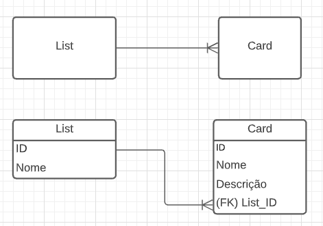

# G-Trello-API

Esta é uma API q simula o funcionamento do backend da parte dos cartões do trello

# Estrutura

A estrutura dessa API foi dividida em camadas, de modo a facilitar o entendimento do código, são elas:

Servidor -> Rotas -> Controllers -> Services -> Repositóries -> Entidades -> DataBase

> Na sequencia lê-se o servidor chama as rotas as rotas por sua vez chamam os controller que chamam os services, este entrar em contato com as entidades que vão fazer alterações na base de dados

# Modelagem do Banco de Dados:

# Rotas

Atualmete a API conta com oito rotas para satisfazer um CRUD para cada tabela do banco!
